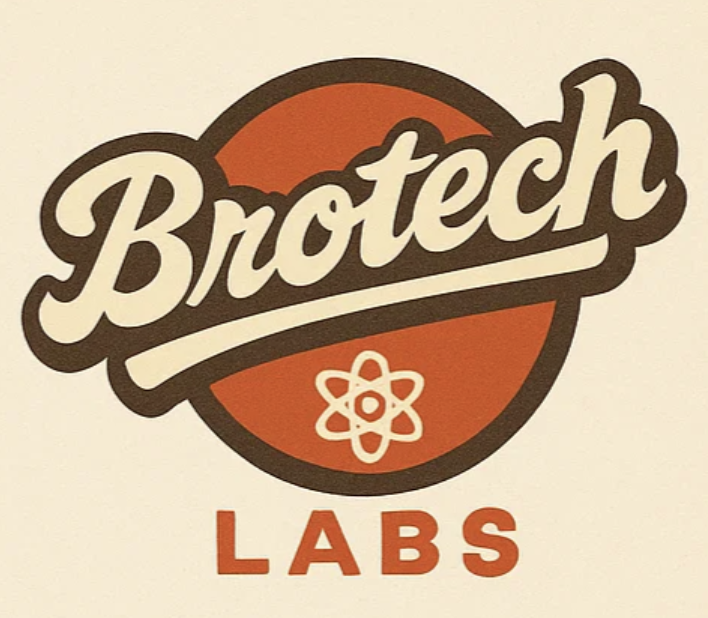

# BroTech Labs Training

  

Comprehensive training materials for IT fundamentals, cloud computing, DevOps, and system administration.

## Core Services

There are come core services that will be used throughout the training. Make sure you have familiarity with them and store unique login information for each using the Bitwarden password manager.

- Core Services Document: [core-services.md](core-services.md)