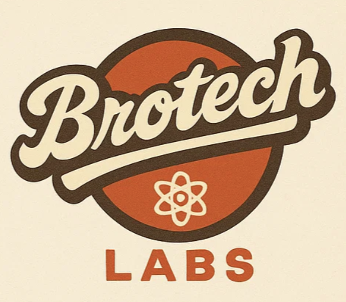

# BroTech Labs Training

  

Comprehensive training materials for IT fundamentals, cloud computing, DevOps, and system administration.

## Core Services

There are come core services that will be used throughout the training. Make sure you have familiarity with them and store unique login information for each using the Bitwarden password manager.

- Core Services Document: [core-services-setup.md](core-services-setup.md)

## Certifications

These certifications will be the goals to complete as you progress through the training. These will greatly increase your employability and job prospects.

- AWS Cloud Practitioner: https://aws.amazon.com/certification/certified-cloud-practitioner/
- AWS AI Practitioner: https://aws.amazon.com/certification/certified-ai-practitioner/
- AWS Solutions Architect Associate: https://aws.amazon.com/certification/certified-solutions-architect-associate/
- Linux Foundation Certified Kubernetes Administrator (LFS258): https://training.linuxfoundation.org/certification/certified-kubernetes-administrator-cka/

## MJ OG Training Repo

https://github.com/mjtechguy/tech-career-launch-pad